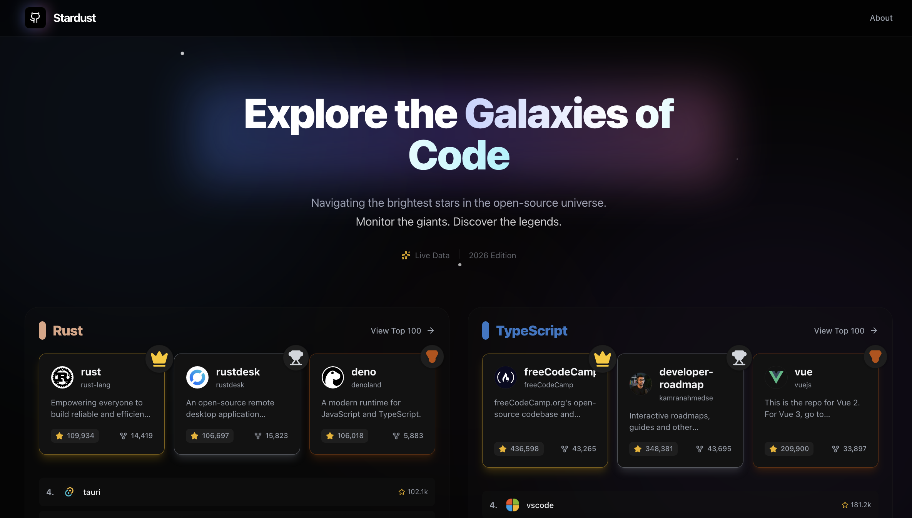

# Stardust

High-performance dashboard for tracking the traction of open source software.
Stardust provides a unified interface to monitor top-tier repositories across multiple ecosystems simultaneously, replacing standard list views with a density-optimized grid.



https://kanywst.github.io/stardust/

## Overview

Standard trending pages isolate languages into individual silos, requiring constant navigation to survey the landscape. Stardust aggregates these streams into a single control plane, allowing developers to track the highest-impact projects in Rust, TypeScript, Python, and other core technologies at a glance.

The interface prioritizes visual hierarchy. The top three repositories in any category are distinct from the rest, emphasizing established dominance over fleeting viral spikes.

## Core Features

- **Multi-Language Matrix**
  Monitor six or more language sectors in a single viewport. No pagination or reloading required to switch contexts.

- **Rank Visualization**
  Distinct visual treatment for top-ranked repositories versus emerging contenders.

- **Instant Interaction**
  Built as a Single Page Application (SPA) using Vite and TanStack Query for zero-latency navigation and data fetching.

- **Deep Focus Mode**
  Expand any category into a cinematic, full-width view of the top 100 repositories.

## Comparison

| Feature           | Stardust                    | GitHub Trending           |
| :---------------- | :-------------------------- | :------------------------ |
| View Architecture | Dashboard (Grid)            | List (Linear)             |
| Context           | Multi-language              | Single-language           |
| Navigation        | Instant (Client-side)       | Page Reload (Server-side) |
| Data Focus        | High Traction / All-time    | Daily / Weekly Spikes     |
| Configuration     | Code-defined (Configurable) | URL Filters               |

## Architecture

- **Runtime:** React 19
- **Language:** TypeScript 5.9
- **Build System:** Vite 7.2
- **Styling:** Tailwind CSS v4
- **Motion:** Framer Motion

## Development

Clone the repository and install dependencies.

```bash
git clone https://github.com/kanywst/stardust.git
cd stardust
npm install
```

Start the local development server.

```bash
npm run dev
```

Build for production.

```bash
npm run build
```

## License

MIT © [kanywst](https://github.com/kanywst)
